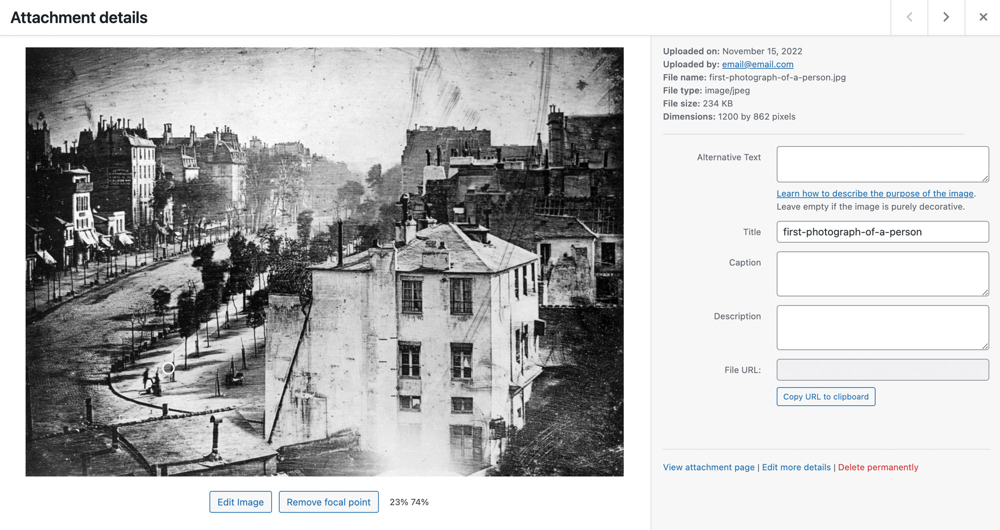

# Image focal point

### WordPress plugin to select a focal point for images in your media library

<br>



## Installation

Upload the plugin folder to the plugins directory, and activate on the plugins page.

## Usage

In your theme, get the focal point position by calling `get_post_meta` with your attachment’s `$id`:

```php
<?php
	$x = get_post_meta($attachmentId, "x", true);
	$y = get_post_meta($attachmentId, "y", true);
?>
```

The values returned are percentages from the left and top edges of the image, so you can use them in `object-position` or `background-position`:

```php
<?php
	$focalpoint = "${x}% ${y}%";
	…
?>

">
```
